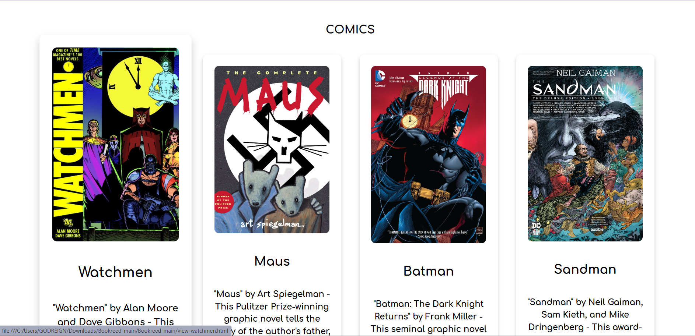
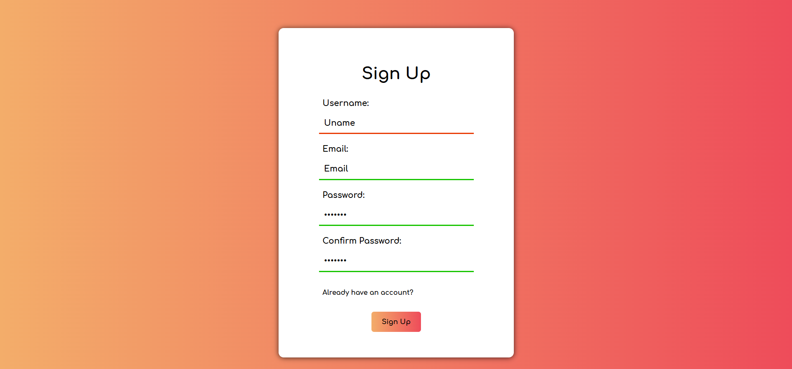

# Bookreed

A simple website for reading books, built with HTML and CSS.

## Description

Bookreed is a basic web project designed for reading books. It features a clean design and is built using HTML and CSS. Currently, it is a static site with no interactive features.

## Installation

1. Clone the repository:
   ```
   git clone https://github.com/GodreignElgin/Bookreed.git
   ```
2. Open `index.html` in a web browser.

## Usage

Open `index.html` to view the book reading interface. Explore the different sections to see the available books.

**Note:** This is a static site with no interactive features such as book selection or reading functionality.

## Screenshots

- **Homepage:**
  

- **Book List:**
  

- **Sign Up:**
  

## Future Improvements

- Add interactive features such as book selection and reading functionality.
- Implement a search function to find books by title, author, or genre.
- Enhance the design with more CSS styling or JavaScript animations.


